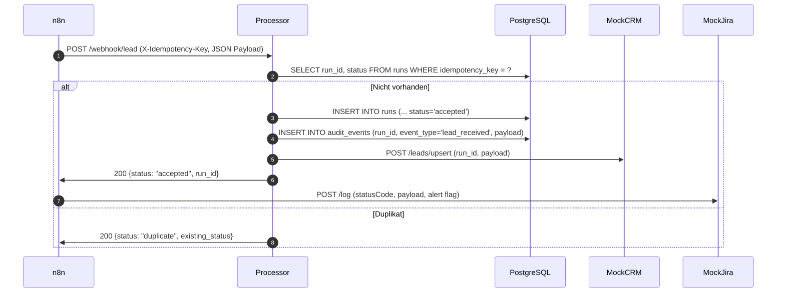

# Architektur & Datenfluss

## Für Nicht-IT (Kurz)
- n8n empfängt Leads über transparente Workflows und ruft den FastAPI-Processor auf.
- Der Processor schreibt jeden Schritt in die PostgreSQL-Datenbank (Runs, Audit, DLQ, KPI) und verhindert Duplikate per Idempotenz.
- Die Architektur dokumentiert, wo Status, Audit und KPI zusammenkommen, sowie die Schnittstellen zwischen den drei Containern.
- HMAC-Signaturen, Mock-CRM/Jira-Logger und Alert-Dateien machen den Flow komplett und sichtbar für Stakeholder.

## Für IT (Details)
- Einen Docker Compose-Netzwerk betreiben drei Container: n8n (Port 5678) für Orchestrierung und Webhook-Eingang, den FastAPI-Processor (Port 8000) für Validierung/Idempotenz und PostgreSQL (Port 5432) für persistente Runs/Audit/DLQ/KPI.
- n8n-Workflows (noch keine Workflow-Dateien), lokale Alerts und Mock-Ports liefern Testdaten, während der Processor die Tabellen `runs`, `audit_events`, `dlq` und `kpi_daily` gemäß `db/schema.sql` beschreibt.
- Die Architektur beschreibt außerdem die Health-Check-Route (`/health`) des Processors, die audit_events vom Typ `health_check` erzeugt, sowie die deduplizierenden Mechanismen des `/webhook/lead`-Endpoints.
- Die Infrastruktur umfasst zusätzlich `mock-crm` (Port 9001) sowie `mock-jira-confluence` (Port 9002). Der Processor ruft das CRM per `httpx` auf, n8n schreibt "would-call"-Payloads und Fehler als Dateien nach `alerts/`, während signierte Webhooks über `WEBHOOK_HMAC_SECRET` / `WEBHOOK_MAX_SKEW_SECONDS` verifiziert werden.

## Komponenten & Verantwortlichkeiten
- **n8n:** Lädt Workflow-Definitionen aus `n8n/workflows`, führt Trigger aus (z.B. manuelles Testen) und ruft die externe URL `http://processor:8000/webhook/lead` mit den benötigten Headern auf.
-   Der Function-Node im Workflow erzeugt `X-Timestamp`/`X-Signature`, sendet den rohen Request und entlässt zusätzlich eine `Mock Jira Logger`-HTTP-Anfrage, die das `alerts/`-Verzeichnis füllt.
- **Processor (FastAPI):** Validiert eingehende Anfragen, kontrolliert die `X-Idempotency-Key`-Header, legt Runs mit Status `accepted` an und schreibt Audit-Events (`lead_received`, `health_check`). Die Idempotenz verhindert doppelte Einträge durch eine Unique-Index-Überprüfung.
-   Der Processor greift mit `httpx.AsyncClient` auf `mock-crm` zu (`MOCK_CRM_URL`), schreibt nach dem Accept-Kontakt das Audit-Event `crm_upserted` und speichert PII-basierte Felder (`email_hash`, `email_masked`). Bei Fehlern landet der Payload inklusive Headern im DLQ und löst das Audit-Event `dlq_created` aus; das gleiche Schema deckt den `X-Fail-After-Accept`-Testpfad ab.
- **PostgreSQL:** Bietet Tabellen für Runs/Audit, speichert abgewiesene Payloads über die DLQ-Tabelle mit individuellen Statuswerten (`open`, `retrying`, `resolved`, `dead`) und aggregiert tägliche KPIs (`kpi_daily`).

## Datenflussbeschreibung

Zusätzlich führt der Endpoint `/health` einen eigenen Audit-Event vom Typ `health_check` aus; er ruft keine Verarbeitungskette aus n8n und schreibt lediglich den Prüfstatus in `audit_events`.

## Idempotenz, Audit & Run-Status
- Idempotenz entsteht durch das einmalige Setzen von `idempotency_key` und den Unique-Index `runs_idempotency_key_uq`; bei vorhandenen Keys liefert der Processor das vorhandene `run_id` und den gespeicherten Status zurück, ohne neue Runs anzulegen.

### DLQ-Testlauf & Fehlerpath
- Für Testläufe wird der Header `X-Fail-After-Accept: 1` eingesetzt: Nach dem Schreiben des Runs wird absichtlich eine Ausnahme geworfen, um den DLQ-Pfad zu überführen.
- Der erreichte Fehlerfall nutzt eine Best-Effort-Verbindung mit `autocommit`, um ein `dlq`-Entry (`reason=forced_failure_after_accept`, `status=open`) und ein Audit-Event `dlq_created` zu schreiben; optional wird `runs.status` auf `failed` gesetzt.
- Dieser Ansatz hält den Intaktheit-Lauf (`runs`/`audit_events`) im Hauptfluss und trennt die DLQ-Logik in eine eigene Transaktion, was auch eine saubere Rückmeldung (`HTTP 500`, „Processing failed; written to DLQ“) erlaubt.
- Die Tabelle `runs` nutzt den Status `accepted` für neu angenommene Payloads, `processed` wenn eine spätere Business-Logik sie abholt und verarbeitet, und `failed` für dauerhaft gescheiterte Läufe. Fehlercodes und -nachrichten bleiben über `error_code`/`error_message` nachvollziehbar.
- Jeder sichtbare Schritt schreibt ein Audit-Event, das die `actor`-Spalte (`webhook` oder `system`), den `event_type` und den vollständigen JSON-`payload` enthält.

## Auditlogik & KPI
- `audit_events` erfasst `event_type` wie `lead_received` (bei Webhook-Intake) oder `health_check` (bei Gesundheitsprüfungen) mit Zeitstempel und optionalem `actor`.
- Die DLQ-Tabelle hält Payloads inklusive `reason`, Parser-Metadaten, `retry_count`, `next_retry_at` und einem Status (`open`, `retrying`, `resolved`, `dead`) für wiederholte Verarbeitung.
- `kpi_daily` aggregiert pro `day` die Anzahl empfangener, verarbeiteter und fehlgeschlagener Runs sowie offene DLQ-Items und die durchschnittliche Verarbeitungslatenz in Millisekunden.`

## Security & PII
- **Nicht-IT:** Alle Webhook-Calls sind signiert, Replay-Checks bewahren Integrität, und `alerts/` dokumentiert jeden Fehler inklusive des sanitierten Payloads.
- **IT:** Der Processor validiert `X-Timestamp`/`X-Signature` (skew über `WEBHOOK_MAX_SKEW_SECONDS`), entfernt `email` aus den Logs und schreibt stattdessen `email_hash` + `email_masked` in `runs` sowie die DLQ/`audit_events`. Fehlerhafte Aufrufe (401/409) lösen einen DLQ-Eintrag mit `alert=true` aus.
